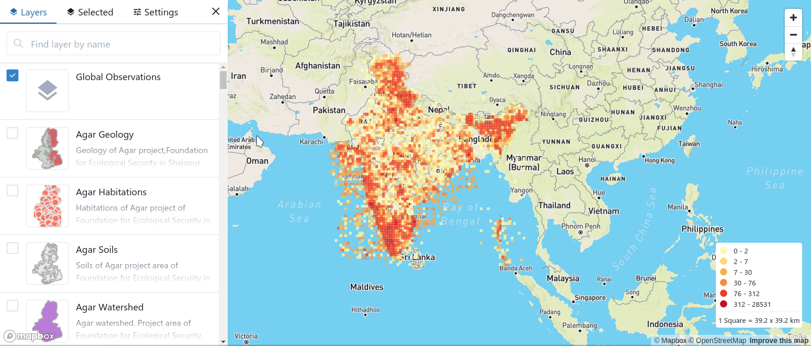
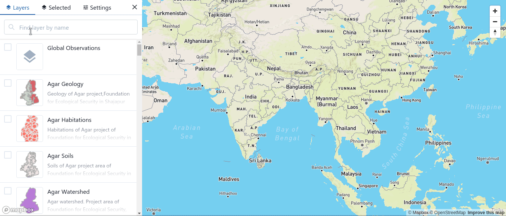

# Naksha Components React 🗺️

[](https://github.com/strandls/naksha-components-react/actions)

[](https://www.typescriptlang.org)
[](https://github.com/prettier/prettier)
[](https://github.com/strandls/naksha-components-react/releases)

Map Components for Biodiversity Informatics Platform





## 🔌 Packages

- [naksha-components-react](./packages/naksha-components-react/README.md)
- [@ibp/naksha-commons](./packages/naksha-commons/README.md)
- [@ibp/naksha-gmaps-draw](./packages/naksha-gmaps-draw/README.md)
- [@ibp/naksha-mapbox-draw](./packages/naksha-mapbox-draw/README.md)
- [@ibp/naksha-mapbox-list](./packages/naksha-mapbox-list/README.md)
- [@ibp/naksha-mapbox-view](./packages/naksha-mapbox-view/README.md)
- [@ibp/naksha-upload](./packages/naksha-upload/README.md)

## 📦 Development Setup

```sh
git clone https://github.com/strandls/naksha-components-react.git
yarn install
yarn bootstrap
```

## 📚 Storybook

for each library examples are available as storybook stories at `packages/**/stories/*.stories.tsx`

```sh
yarn storybook
```

## 🌀 Using without `@chakra-ui/react`

If you are using any component in a project where `chakra-ui` is not initialized/used you need to do so manually like below

```jsx
import { ChakraProvider } from "@chakra-ui/react";
import { ComponentX } from "naksha-components-react";

<ChakraProvider>
  <ComponentX />
</ChakraProvider>;
```

## 🔧 Configuration

Code quality checks are done with `prettier`, `eslint`.

## 🤠 Credits

- [tsdx](https://github.com/jaredpalmer/tsdx)
- [typescript](https://github.com/microsoft/TypeScript)
- [chakra-ui](https://github.com/chakra-ui/chakra-ui)
- [react-map-gl](https://github.com/uber/react-map-gl)

## 🙏 Contributing

Contributions/Suggestions are always welcome!

## 📄 License

Apache-2.0 &copy; [Strand Life Sciences](https://github.com/strandls)
